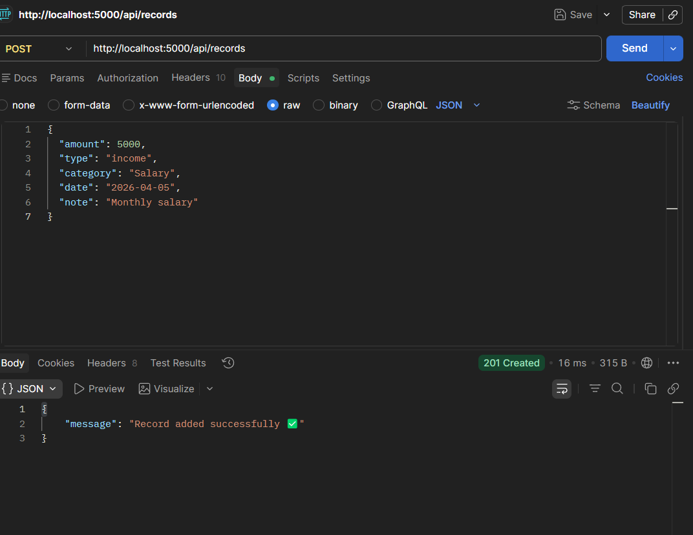
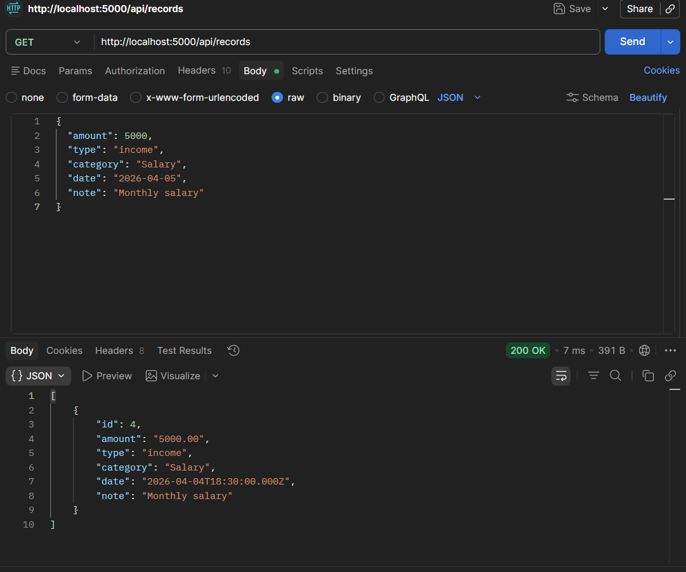
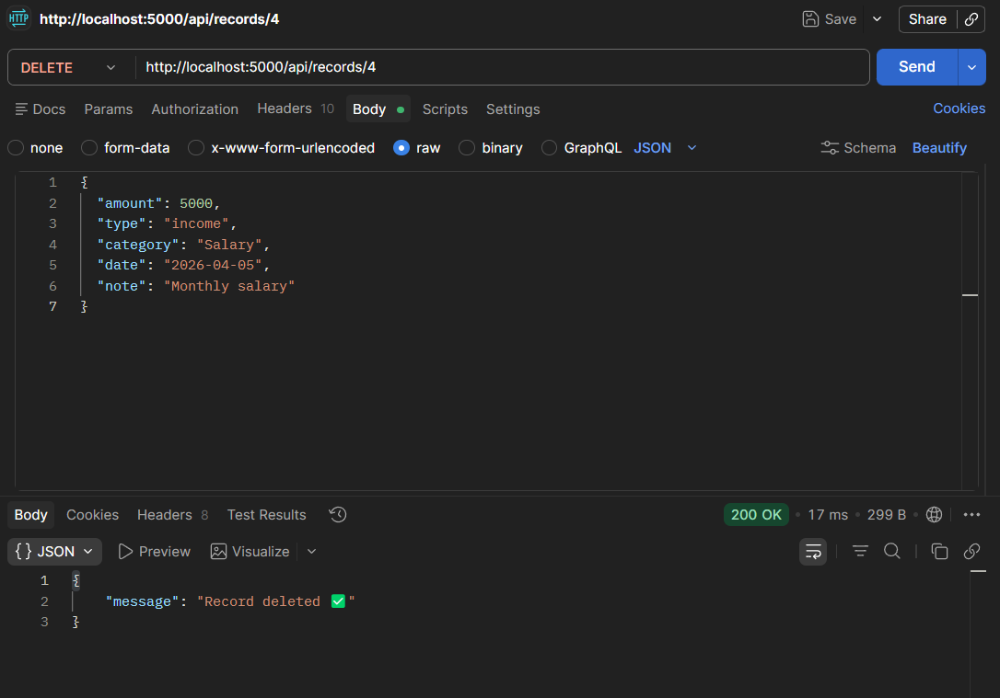

# 💰 Finance Data Processing & Access Control Backend

## 📌 Project Overview

This project is a backend system for a finance dashboard application that manages financial records and user access based on roles. It demonstrates backend design, API development, data handling, and role-based access control.

The system allows users to manage income and expense records, view aggregated financial insights, and restrict actions based on user roles.

---

## 🚀 Features

### 👤 User Management

* Create users with roles (Admin, Analyst, Viewer)
* View users
* Role-based access restrictions

### 💰 Financial Records

* Create financial records (income/expense)
* View all records
* View record by ID
* Update records
* Delete records

### 📊 Dashboard APIs

* Total Income
* Total Expense
* Net Balance
* Category-wise summary

### 🔐 Role-Based Access Control

* Admin → Full access
* Analyst → View + dashboard access
* Viewer → View-only access

### ⚠️ Validation & Error Handling

* Required field validation
* Proper HTTP status codes
* Error messages for invalid operations

---

## 🛠️ Tech Stack

* **Backend:** Node.js, Express.js
* **Database:** MySQL
* **Testing Tool:** Postman
* **Environment Management:** dotenv

---

## 📁 Project Structure

```
finance-backend/
│
├── config/
│   └── db.js
├── controllers/
│   ├── userController.js
│   └── recordController.js
├── middleware/
│   └── authMiddleware.js
├── routes/
│   ├── userRoutes.js
│   └── recordRoutes.js
├── server.js
├── .env
└── package.json
```

---

## ⚙️ Setup Instructions

### 1️⃣ Clone the Repository

```
git clone <your-repo-link>
cd finance-backend
```

### 2️⃣ Install Dependencies

```
npm install
```

### 3️⃣ Configure Environment

Create `.env` file:

```
PORT=5000
DB_HOST=localhost
DB_USER=root
DB_PASSWORD=yourpassword
DB_NAME=finance_db
```

### 4️⃣ Run Server

```
npx nodemon server.js
```

---

## 🗄️ Database Schema

### Users Table

* id
* name
* email
* role (admin, analyst, viewer)
* status

### Records Table

* id
* amount
* type (income, expense)
* category
* date
* note

---

## 📡 API Endpoints

### 👤 User APIs

| Method | Endpoint   | Description   | Access         |
| ------ | ---------- | ------------- | -------------- |
| POST   | /api/users | Create user   | Admin          |
| GET    | /api/users | Get all users | Admin, Analyst |

---

### 💰 Record APIs

| Method | Endpoint         | Description      | Access |
| ------ | ---------------- | ---------------- | ------ |
| POST   | /api/records     | Create record    | Admin  |
| GET    | /api/records     | Get all records  | All    |
| GET    | /api/records/:id | Get record by ID | All    |
| PUT    | /api/records/:id | Update record    | Admin  |
| DELETE | /api/records/:id | Delete record    | Admin  |

---

### 📊 Dashboard APIs

| Method | Endpoint              | Description      | Access         |
| ------ | --------------------- | ---------------- | -------------- |
| GET    | /api/records/income   | Total income     | Admin, Analyst |
| GET    | /api/records/expense  | Total expense    | Admin, Analyst |
| GET    | /api/records/balance  | Net balance      | Admin, Analyst |
| GET    | /api/records/category | Category summary | Admin, Analyst |

---

## 🔐 Role-Based Access

| Role    | Permissions      |
| ------- | ---------------- |
| Admin   | Full access      |
| Analyst | View + analytics |
| Viewer  | View only        |

---

## 🧪 Testing

Use Postman and include header:

```
role: admin
```

or

```
role: analyst
```

or

```
role: viewer
```

---

## 🌟 Key Highlights

* Clean backend architecture
* Role-based authorization
* Aggregated financial analytics
* RESTful API design
* Error handling and validation

---

## 📌 Conclusion

This project demonstrates strong backend development skills including API design, database interaction, access control, and logical structuring of services. It is designed to simulate a real-world financial dashboard backend system.

---

## 👩‍💻 Author

**Sowmya**
Information Science Engineering Student
Aspiring Software Developer 🚀

Screenshots of outputs


